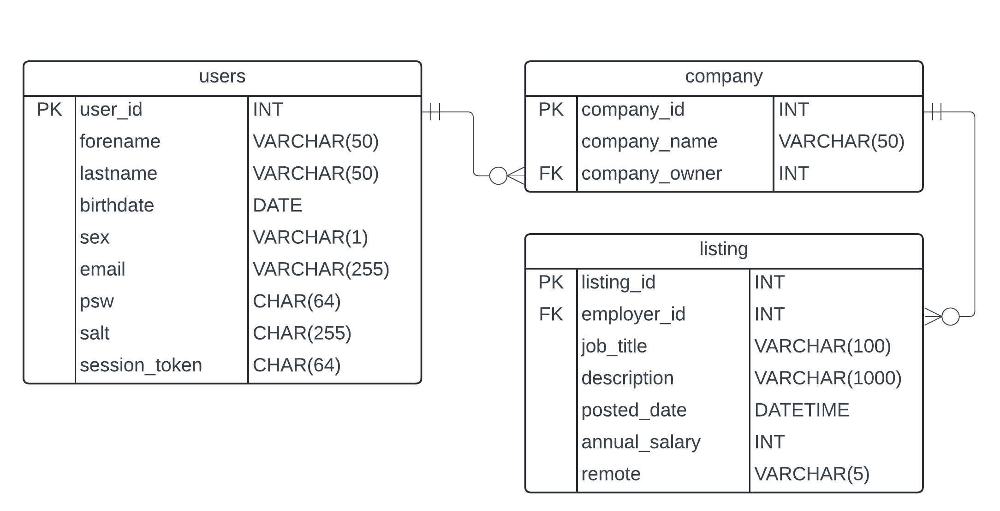

# Online Job Platform REST API

### Introduction

Online Job Platform REST API is an open source platform which enables a user base that owns companies to reach to potential employees via job listings.

### Technologies Used

Online Job Platfrom REST API is based on [TypeScript](https://www.typescriptlang.org/), [NodeJS](https://nodejs.org/), [ExpressJS](https://expressjs.com/) and [MySql](https://www.mysql.com/).

<div style="display: flex; justify-content: center;">
    
    
    
    
</div>

### Installation Guide

1. Clone this repository [here](https://github.com/marcopagotto/online-job-platform-REST-API.git)
2. Install the project's dependencies:

```
npm install
```

3. Start your MySql server instance (download mysql [here](https://dev.mysql.com/downloads/mysql/))
4. Create an .env file in your project root folder and add your variables accordingly to .env.sample

### Usage

Activate the TypeScript compiler:

```
npm run tsc
```

Run the application by starting the server:

```
npm run dev
```

Connect to the API using Postman on the port specified at .env.

| HTTP Verbs | Endpoints                 | Action                                           | Restrictions                                                           |
| ---------- | ------------------------- | ------------------------------------------------ | ---------------------------------------------------------------------- |
| POST       | /api/user                 | To create a new user                             | No restrictions                                                        |
| POST       | /api/user/login           | To authenticate the user                         | No restrictions                                                        |
| POST       | /api/company              | To create a new company                          | <ul><li>User must be authenticated</ul>                                |
| POST       | /api/listing              | To publish a job listing                         | <ul><li>User must be authenticated <li>User must be listing owner</ul> |
| GET        | /api/user/:user_id        | To retrive the user with the provided id         | <ul><li>User must be authenitcated</ul>                                |
| GET        | /api/company/:company_id  | To retrive the company with the provided id      | <ul><li>User must be authenitcated</ul>                                |
| GET        | /api/listings             | To retrive job listings                          | <ul><li>User must be authenitcated</ul>                                |
| GET        | /api/listing/:listing_id  | To retrive the job listing with the spcified id  | <ul><li>User must be authenitcated</ul>                                |
| PATCH      | /api/user/update-password | To update the password of the authenticated user | <ul><li>User must be authenitcated</ul>                                |
| PATCH      | /api/user                 | To update authenticated user's fields            | <ul><li>User must be authenticated</ul>                                |
| PATCH      | /api/listing/:listing_id  | To update listing's fields                       | <ul><li>User must be authenticated <li>User must be listing owner</ul> |
| DELETE     | /api/user                 | To delete the authenticated user                 | <ul><li>User must be authenticated</ul>                                |
| DELETE     | /api/company/:company_id  | To delete the company with the specified id      | <ul><li>User must be authenticated <li>User must be company owner</ul> |
| DELETE     | /api/listing/:listing_id  | To delete the listing with the specified id      | <ul><li>User must be authenticated <li>User must be listing owner</ul> |

### Query Parameters

| Method | Path          | Query parameters           |
| ------ | ------------- | -------------------------- |
| GET    | /api/listings | <em>amount</em> - number   |
| GET    | /api/listings | <em>newFirst</em> - 0 or 1 |

### Entity-Relationship Diagram



### Examples of Requests and Responeses

Examples of requests and corresponding responses that demonstrate the usage of the API endpoints are being provided underneath (in the examples provided server is hosted at port 8080):

<li><b>User registration:</b></br>
<em>Path:</em> <code>http://localhost:8080/api/user</code></br>
<em>Request method</em>: <b>
<span style="color: #FFD700;">POST</span>
</b></br>
<em>Request body:</em>

```json
{
  "forename": "John",
  "lastname": "Smith",
  "sex": "M",
  "birthdate": "2000-01-01",
  "email": "johnsmith@email.com",
  "psw": "John123"
}
```

<em>Response body:</em>

```json
[
  {
    "user_id": 1,
    "forename": "John",
    "lastname": "Smith",
    "birthdate": "1999-12-31T23:00:00.000Z",
    "sex": "M",
    "email": "johnsmith@email.com"
  }
]
```

Notes: </br>email provided in <em>Request Body</em> must be unique
</br>

<li><b>User authentication:</b></br>
<em>Path:</em> <code>http://localhost:8080/api/user/login</code></br>
<em>Request method</em>: <b>
<span style="color: #FFD700;">POST</span>
</b></br>
<em>Request body:</em>

```json
{
  "email": "johnsmith@email.com",
  "psw": "John123"
}
```

<em>Response body:</em>

```json
[
  {
    "user_id": 1,
    "forename": "John",
    "lastname": "Smith",
    "birthdate": "1999-12-31T23:00:00.000Z",
    "sex": "M",
    "email": "johnsmith@email.com",
    "session_token": "76dc7c993203891c3f1ba66a89a9e612fdfa61f476ba75eafed0e239ea3e46f9"
  }
]
```

Notes:
<code>AUTH-LOGIN</code> cookie attached:
| Name | Value | Domain | Path | Expires | HttpOnly | Secure |
|-|-|-|-|-|-|-|
AUTH-LOGIN |76dc7c993203891c3f1ba6<br>6a89a9e612fdfa61f476ba7<br>5eafed0e239ea3e46f9|localhost|/|Session|false|false|

<li><b>Create company:</b></br>
<em>Path:</em> <code>http://localhost:8080/api/company</code></br>
<em>Request method</em>: <b>
<span style="color: #FFD700;">POST</span>
</b></br>

<em>Request body</em>:

```json
{
  "company_name": "John's Tech"
}
```

<em>Response body:</em>

```json
[
  {
    "company_id": 1,
    "company_name": "John's Tech",
    "company_owner": 1
  }
]
```

<li><b>Publish listing:</b></br>
<em>Path:</em> <code>http://localhost:8080/api/listing</code></br>
<em>Request method</em>: <b>
<span style="color: #FFD700;">POST</span>
</b></br>

<em>Request body</em>:

```json
{
  "employer_id": 1,
  "job_title": "Junior React Developer",
  "description": "Are you a passionate and eager-to-learn junior developer looking for an exciting opportunity to start your career in the dynamic field of web development? Look no further! John's Tech is seeking a talented React Junior Developer to join our team and contribute to the development of innovative web applications.",
  "annual_salary": "100000",
  "remote": true
}
```

<em>Response body:</em>

```json
[
  {
    "listing_id": 1,
    "employer_id": 1,
    "job_title": "Junior React Developer",
    "description": "Are you a passionate and eager-to-learn junior developer looking for an exciting opportunity to start your career in the dynamic field of web development? Look no further! John's Tech is seeking a talented React Junior Developer to join our team and contribute to the development of innovative web applications.",
    "posted_date": "2024-05-19T14:12:56.000Z",
    "annual_salary": 100000,
    "remote": "true"
  }
]
```

<li><b>Get user:</b></br>
<em>Path:</em> <code>http://localhost:8080/api/user/1</code></br>
<em>Request method</em>: <b>
<span style="color: green;">GET</span>
</b></br>

<em>Response body:</em>

```json
[
  {
    "user_id": 1,
    "forename": "John",
    "lastname": "Smith",
    "birthdate": "1999-12-31T23:00:00.000Z",
    "sex": "M",
    "email": "johnsmith@email.com"
  }
]
```

<li><b>Get company:</b></br>
<em>Path:</em> <code>http://localhost:8080/api/company/1</code></br>
<em>Request method</em>: <b>
<span style="color: green;">GET</span>
</b></br>

<em>Response body:</em>

```json
[
  {
    "company_id": 1,
    "company_name": "John's Tech",
    "company_owner": 1
  }
]
```

<li><b>Get listings:</b></br>
<em>Path:</em> <code>http://localhost:8080/api/listings</code></br>
<em>Request method</em>: <b>
<span style="color: green;">GET</span>
</b></br>

<em>Response body:</em>

```json
[
  {
    "listing_id": 1,
    "employer_id": 1,
    "job_title": "Junior React Developer",
    "description": "Are you a passionate and eager-to-learn junior developer looking for an exciting opportunity to start your career in the dynamic field of web development? Look no further! John's Tech is seeking a talented React Junior Developer to join our team and contribute to the development of innovative web applications.",
    "posted_date": "2024-05-19T14:12:56.000Z",
    "annual_salary": 100000,
    "remote": "true"
  }
]
```

Notes: </br> by default the amount of listings returned is capped at 10 - in the example provided there is only one listing in the database - to specify the amount of listings returned, "amount" query should be included:<code>.../api/listings?amount=10</code>
In addition you may want to see the most recent listings - in such a case use "newFirst" query to achieve so:<code>.../api/listings?newFirst=1</code>.

</br>

<li><b>Get listing:</b></br>
<em>Path:</em> <code>http://localhost:8080/api/listing/1</code></br>
<em>Request method</em>: <b>
<span style="color: green;">GET</span>
</b></br>

<em>Response body:</em>

```json
[
  {
    "listing_id": 1,
    "employer_id": 1,
    "job_title": "Junior React Developer",
    "description": "Are you a passionate and eager-to-learn junior developer looking for an exciting opportunity to start your career in the dynamic field of web development? Look no further! John's Tech is seeking a talented React Junior Developer to join our team and contribute to the development of innovative web applications.",
    "posted_date": "2024-05-19T14:12:56.000Z",
    "annual_salary": 100000,
    "remote": "true"
  }
]
```

<li><b>Update password:</b></br>
<em>Path:</em> <code>http://localhost:8080/api/user/update-password</code></br>
<em>Request method</em>: <b>
<span style="color: purple">PATCH</span>
</b></br>

<em>Request body</em>:

```json
{
  "oldPsw": "John123",
  "newPsw": "NewJohn123"
}
```

<em>Response body:</em>

```json
"Password updated correctly. Please login again."
```

<li><b>Update user:</b></br>
<em>Path:</em> <code>http://localhost:8080/api/user</code></br>
<em>Request method</em>: <b>
<span style="color: purple">PATCH</span>
</b></br>

<em>Request body</em>:

```json
{
  "forename": "Harry",
  "lastname": "Smith",
  "birthdate": "1999-01-01"
}
```

<em>Response body:</em>

```json
{
  "user_id": 1,
  "forename": "Harry",
  "lastname": "Smith",
  "birthdate": "1998-12-31T23:00:00.000Z",
  "sex": "M",
  "email": "johnsmith@email.com",
  "session_token": "c70e8805147624b3642b3c07a55e33c169c326d53cfdfe3ef779fa9a1996c408"
}
```

Notes: </br> you may notice that <code>"session_token"</code> has been updated as user had to authenticate again upon updating password.

</br>

<li><b>Update listing:</b></br>
<em>Path:</em> <code>http://localhost:8080/api/listing/1</code></br>
<em>Request method</em>: <b>
<span style="color: purple">PATCH</span>
</b></br>

<em>Request body</em>:

```json
{
  "annual_salary": 120000
}
```

<em>Response body:</em>

```json
[
  {
    "listing_id": 1,
    "employer_id": 1,
    "job_title": "Junior React Developer",
    "description": "Are you a passionate and eager-to-learn junior developer looking for an exciting opportunity to start your career in the dynamic field of web development? Look no further! John's Tech is seeking a talented React Junior Developer to join our team and contribute to the development of innovative web applications.",
    "posted_date": "2024-05-19T14:12:56.000Z",
    "annual_salary": 120000,
    "remote": "true"
  }
]
```

<li><b>Delete listing:</b></br>
<em>Path:</em> <code>http://localhost:8080/api/listing/1</code></br>
<em>Request method</em>: <b>
<span style="color: red">DELETE</span>
</b></br>

<em>Response body:</em>

```json
{
  "listing_id": 1,
  "employer_id": 1,
  "job_title": "Junior React Developer",
  "description": "Are you a passionate and eager-to-learn junior developer looking for an exciting opportunity to start your career in the dynamic field of web development? Look no further! John's Tech is seeking a talented React Junior Developer to join our team and contribute to the development of innovative web applications.",
  "posted_date": "2024-05-19T14:12:56.000Z",
  "annual_salary": 120000,
  "remote": "true"
}
```

<li><b>Delete company:</b></br>
<em>Path:</em> <code>http://localhost:8080/api/listing/1</code></br>
<em>Request method</em>: <b>
<span style="color: red">DELETE</span>
</b></br>

<em>Response body:</em>

```json
{
  "company_id": 1,
  "company_name": "John's Tech",
  "company_owner": 1
}
```

<li><b>Delete user:</b></br>
<em>Path:</em> <code>http://localhost:8080/api/user</code></br>
<em>Request method</em>: <b>
<span style="color: red">DELETE</span>
</b></br>

<em>Response body:</em>

```json
{
  "user_id": 1,
  "forename": "Harry",
  "lastname": "Smith",
  "birthdate": "1998-12-31T23:00:00.000Z",
  "sex": "M",
  "email": "johnsmith@email.com"
}
```

Notes: </br> deleting user will cascade companies and listings associated to them.

### Authors
The project has been built with the contribution of
[Marco Pagotto](https://github.com/marcopagotto)


### License
This project is available for use under the MIT License.
